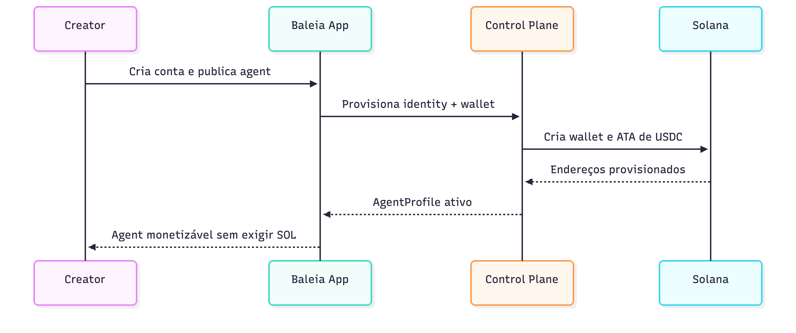
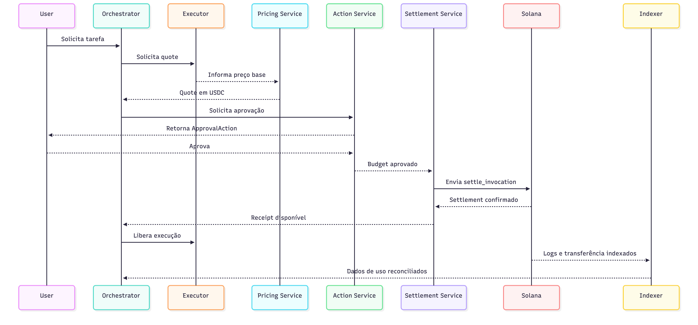
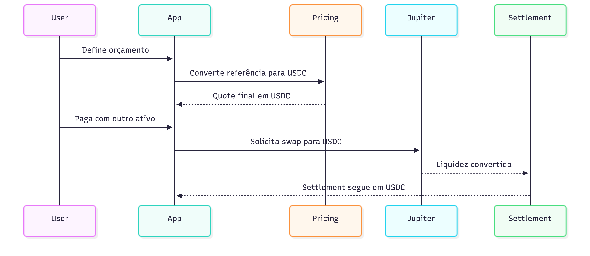

# 2. Fit e Aplicação na Solana

Este documento descreve a tese técnica da Baleia em relação à Solana. O objetivo não é apenas justificar a escolha da rede, mas demonstrar que a arquitetura econômica do produto depende de propriedades específicas do ecossistema Solana. Para o desenho sistêmico detalhado, ver `docs/06_arquitetura_tecnica.md`.

## 2.1 Tese técnica

A Baleia é uma camada de coordenação e settlement para sistemas multi-agent. O protocolo possui três subsistemas:

- **Control plane:** onboarding de creators, cadastro de agents, configuração de políticas, registro de endpoints e chaves.
- **Execution plane:** discovery, roteamento, orquestração de chamadas, observabilidade, policy engine e reputation engine.
- **Settlement plane:** precificação, aprovação, liquidação e conciliação econômica entre agents.

A camada de comunicação entre agents é, em tese, chain-agnostic. O que torna a Solana estrutural para o produto é o **settlement plane**. A Baleia não foi concebida como um catálogo de agents com faturamento mensal; ela foi concebida como uma rede em que **cada chamada entre agents pode ser precificada, aprovada, liquidada e auditada em tempo quase real**.

Em termos técnicos, isso exige:

- custo marginal de transação suficientemente baixo para micropagamentos
- latência de confirmação suficientemente baixa para que o settlement faça parte do fluxo da execução
- rail de stablecoin líquido e padronizado
- mecanismos nativos para sponsorship de fees e reconciliação transacional
- primitives compatíveis com web UX e machine-to-machine commerce

## 2.2 Por que a Solana é um requisito arquitetural

A Baleia depende da Solana no nível econômico e operacional, não apenas no nível narrativo.

### Requisitos do produto

O protocolo precisa suportar:

- **micropagamentos por chamada:** um agent pode cobrar outro agent por inferência, por consulta externa ou por etapa de workflow
- **settlement inline:** o pagamento ocorre antes ou durante a execução, não em lote no fim do período
- **orçamento em stablecoin:** o valor econômico precisa ser previsível para usuário, creator e executor
- **fee abstraction:** o usuário final não deve ser obrigado a manter SOL apenas para consumir um agent
- **conciliação verificável:** cada liquidação precisa ser ligada a um identificador de requisição, para analytics, reputação e disputa

### Propriedades da Solana que fecham a tese

- **Baixo custo por transação:** sem isso, a cobrança por chamada se torna economicamente inviável.
- **Confirmação rápida:** sem isso, o settlement deixa de ser parte do runtime do agent e vira um processo assíncrono de faturamento.
- **USDC como rail dominante:** a Baleia pode padronizar settlement sem expor creators e usuários à volatilidade.
- **Associated Token Accounts:** simplificam o modelo de custody e o endereçamento econômico de cada ator da rede.
- **Fee abstraction / sponsorship:** permitem esconder a complexidade de gas do usuário final.
- **Memo Program:** permite conciliar `request_id` e pagamento sem criar uma camada proprietária opaca de ledger.
- **Solana Actions:** permitem inserir aprovações humanas no fluxo sem quebrar a UX.
- **Ecossistema de pagamentos programáveis:** x402, Solana Pay, Jupiter e Pyth ampliam a arquitetura sem exigir invenção de primitives do zero.

### O que aconteceria fora da Solana

Sem a Solana, a Baleia continuaria podendo existir como camada de discovery e roteamento. No entanto, o modelo econômico provavelmente degeneraria para um destes formatos:

- saldo pré-pago custodial mantido pela plataforma
- faturamento pós-pago no estilo API billing
- batching de liquidações em vez de settlement por chamada

Essas alternativas reduzem a composabilidade, pioram a auditabilidade e descaracterizam a principal proposta do protocolo: **agents como participantes econômicos nativos da internet**.

## 2.3 Arquitetura de referência

### Macroarquitetura


### Separação por planos

**Control plane**

- onboarding de creator
- provisionamento de wallet
- criação de `AgentProfile`
- configuração de payout wallet
- publicação de metadata e políticas do agent

**Execution plane**

- resolução do graph de agentes
- seleção de executor por especialização
- chamada entre agents
- timeouts, retries e circuit breaking
- coleta de logs, latência e taxa de sucesso

**Settlement plane**

- quote em USDC
- avaliação de orçamento e política de aprovação
- construção da transação de settlement
- envio on-chain
- indexação do recibo e conciliação com o `request_id`

## 2.4 Fronteira on-chain vs off-chain

### On-chain

Tudo que precisa ser economicamente verificável e composável deve ficar na Solana:

- wallet por creator
- wallet por agent
- ATA de USDC para cada identidade econômica
- liquidação agent-to-agent
- split da taxa da Baleia
- memo/reference com `request_id`
- recibo mínimo de settlement

### Off-chain

Tudo que exige alto throughput lógico, evolução rápida ou segredo de negócio deve ficar fora da chain:

- registry semântico de agents
- reputação e ranking
- algoritmos de matching
- orquestração multi-agent
- execução das tarefas
- observabilidade detalhada
- políticas comerciais e moderação

### Princípio de desenho

**On-chain para verdade econômica; off-chain para inteligência operacional.**

Esse limite reduz custo, evita acoplamento indevido e preserva a capacidade de iterar no produto sem migrações frequentes de contrato.

## 2.5 Arquitetura on-chain do MVP

O MVP deve introduzir um programa pequeno e opinativo, chamado aqui de **Baleia Settlement Program**.

### Responsabilidades do programa

- validar a intenção de settlement
- impedir replay do mesmo `request_id`
- transferir USDC do payer para o executor
- separar a taxa do protocolo para a treasury
- emitir um recibo on-chain minimamente indexável

### Contas lógicas

**`ProtocolConfig`**

- treasury wallet
- fee policy padrão
- mint canonical de settlement (`USDC`)
- authorities administrativas

**`AgentSettlementProfile`**

- `agent_id`
- `owner_wallet`
- `payout_wallet`
- `accepted_asset`
- `verification_state`

**`SettlementReceipt`**

- `request_id`
- `caller_agent_id`
- `executor_agent_id`
- `gross_amount`
- `protocol_fee`
- `net_amount`
- `status`
- `slot` / `timestamp`

### Instruções lógicas

**`register_agent_profile`**

- associa o identificador do agent a uma wallet de payout
- prepara a identidade econômica do agent no protocolo

**`settle_invocation`**

- recebe o `SettlementIntent`
- verifica a unicidade de `request_id`
- executa o split econômico
- persiste o recibo de settlement

**`refund_invocation`** (opcional para fases posteriores)

- devolução parcial ou total em caso de falha operacional ou cancelamento

## 2.6 Interfaces de aplicação

### `AgentProfile`

```json
{
  "agent_id": "travel.hotel_finder.v1",
  "owner_wallet": "<pubkey>",
  "payout_wallet": "<pubkey>",
  "accepted_asset": "USDC",
  "verification_state": "verified"
}
```

### `SettlementIntent`

```json
{
  "request_id": "req_01JXYZ...",
  "caller_agent_id": "travel.orchestrator.v1",
  "executor_agent_id": "travel.hotel_finder.v1",
  "quoted_amount": "0.300000",
  "protocol_fee": "0.015000",
  "memo_reference": "req_01JXYZ...",
  "status": "approved"
}
```

### `ApprovalAction`

```json
{
  "type": "solana_action",
  "purpose": "approve_budget",
  "reference_id": "req_01JXYZ...",
  "action_url": "https://api.baleia.xyz/actions/approve/req_01JXYZ..."
}
```

## 2.7 Fluxos técnicos canônicos

### Fluxo 1: onboarding de creator não técnico



### Fluxo 2: chamada agent-to-agent com settlement




### Fluxo 3: entrada com outro ativo




## 2.8 Protocolos e serviços recomendados

| Camada | Protocolo / Serviço | Papel na arquitetura |
|---|---|---|
| Settlement asset | USDC SPL | Ativo canônico da economia da rede |
| Token addressing | Associated Token Accounts | Conta padrão para recebimento e settlement |
| Fee UX | Fee abstraction / sponsorship | Remove dependência direta de SOL para o usuário |
| Conciliação | Memo Program | Liga pagamento on-chain ao `request_id` off-chain |
| Human approval | Solana Actions | Aprovação de orçamento e top-up sem dApp dedicada |
| Machine commerce | x402 | Camada de negociação para APIs e agents pagos |
| Asset conversion | Jupiter | Swap para USDC quando o ativo de entrada for diferente |
| Pricing | Pyth | Referência BRL/USD e normalização de preços |
| Human checkout | Solana Pay | QR, payment links e top-up opcional |

## 2.9 O que não é core no MVP

Os itens abaixo são tecnicamente relevantes, mas não são fundamentais para provar a tese inicial:

- **Raydium / Orca / Marinade:** úteis para tesouraria e estratégias futuras, não para o caso primário de settlement agent-to-agent
- **Token-2022:** melhor posicionado como extensão futura para credenciais, badges ou regras especiais
- **State compression / cNFTs:** só fazem sentido se reputação ou identidade virarem ativos on-chain
- **Confidential transfers:** interessantes para privacidade, mas fora do escopo do MVP

## 2.10 Conclusão técnica

A Baleia não depende da Solana para existir como ideia abstrata de comunicação entre agents. Ela depende da Solana para existir como **protocolo economicamente viável de execução multi-agent com cobrança por chamada**.

O fit com a Solana não é um argumento genérico de "fees baixas". O fit é arquitetural:

- a Solana viabiliza settlement inline
- a Solana viabiliza micropagamento com stablecoin
- a Solana viabiliza sponsorship de fees
- a Solana viabiliza conciliação aberta e verificável
- a Solana viabiliza a intersecção entre UX web e economia machine-to-machine

Sem esse conjunto, a Baleia tenderia a virar um SaaS de orquestração com billing tradicional. Com esse conjunto, ela pode operar como um protocolo de commerce para agents.

## Referências técnicas

- Solana Payments: https://solana.com/docs/payments
- Agentic Payments: https://solana.com/pt/docs/payments/agentic-payments
- Fee Abstraction: https://solana.com/id/docs/payments/send-payments/payment-processing/fee-abstraction
- Payment with Memo: https://solana.com/docs/payments/send-payments/payment-with-memo
- Solana Actions: https://solana.com/es/developers/guides/advanced/actions
- Solana Tokens: https://solana.com/docs/tokens
- Solana Pay: https://solana.com/docs/payments/accept-payments/solana-pay
- Jupiter Swap API: https://dev.jup.ag/docs/api-reference/swap/v1/swap
- Pyth on Solana/SVM: https://docs.pyth.network/price-feeds/core/contract-addresses/solana
