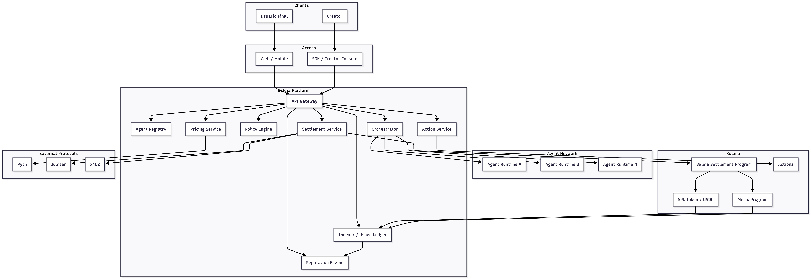
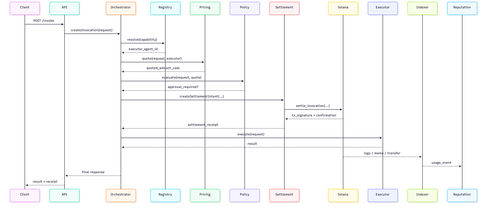

# 6. Arquitetura Técnica da Baleia

Este documento consolida a arquitetura de referência da Baleia em nível de sistema. O foco é descrever como os componentes se relacionam, quais contratos lógicos existem entre eles e onde a Solana entra como camada de settlement.

## 6.1 Objetivo do sistema

A Baleia é um protocolo para composição econômica entre agents. O sistema precisa permitir que:

- creators publiquem agents monetizáveis
- um agent descubra e invoque outro agent
- cada invocação possa ser cotada, aprovada e liquidada
- o pagamento gere evidências verificáveis
- os dados econômicos alimentem ranking, analytics e reputação

## 6.2 Princípios de arquitetura

- **Separation of concerns:** execução, descoberta e reputação não devem ficar no mesmo domínio do settlement.
- **Economic truth on-chain:** tudo que define transferências de valor precisa ser verificável e auditável.
- **Operational intelligence off-chain:** matching, policy e scoring devem permanecer fora da chain.
- **Stablecoin-first economy:** o protocolo padroniza settlement em USDC.
- **Human-in-the-loop when needed:** o sistema deve permitir aprovação humana em gastos sensíveis sem quebrar a automação.

## 6.3 Componentes principais

### Interfaces de acesso

**Web App / Mobile App**

- interface para o usuário final
- configuração de orçamento
- aprovação de gastos
- visualização de resultados e receipts

**Creator Console / SDK**

- onboarding de creator
- publicação de agents
- definição de endpoints, preço e políticas
- gestão de payout wallet e configurações do agent

### Back-end de plataforma

**API Gateway**

- autenticação
- rate limiting
- exposição unificada de APIs

**Agent Registry**

- catálogo semântico de agents
- metadata técnica e comercial
- capacidades, tags, versões e estado de verificação

**Orchestrator**

- resolve o plano de execução
- decide qual agent chamar
- encadeia subtarefas
- lida com retries, fallback e cancelamento

**Policy Engine**

- define se uma chamada exige aprovação humana
- valida limites de orçamento
- aplica regras por creator, usuário ou categoria

**Pricing Service**

- converte preços para USDC
- aplica fee policy
- consulta referências de preço

**Action Service**

- gera `ApprovalAction`
- integra com Solana Actions
- injeta contexto de aprovação no fluxo da aplicação

**Settlement Service**

- materializa o `SettlementIntent`
- monta e envia a transação de settlement
- acompanha a confirmação
- reconcilia receipt

**Indexer / Usage Ledger**

- consome logs e receipts on-chain
- relaciona `request_id`, assinatura e entidades de domínio
- gera dados brutos para analytics e reputação

**Reputation Engine**

- calcula score
- pondera sucesso, uso, especialização e latência
- permanece totalmente off-chain

## 6.4 Integrações externas

**Solana RPC**

- submissão de transações
- confirmação
- leitura de receipts e logs

**USDC / SPL Token Program**

- rail canônico de transferências de valor

**Memo Program**

- conciliação transacional via `request_id`

**Pyth**

- precificação e referências de câmbio

**Jupiter**

- swap para USDC quando necessário

**Solana Actions**

- aprovação humana e UX transacional

**x402**

- formato de negociação de pagamento por request em cenários API-to-agent ou agent-to-agent

## 6.5 Topologia do sistema

## 6.6 Modelo de domínio

### `AgentProfile`

Representa a identidade operacional e econômica de um agent.

Campos centrais:

- `agent_id`
- `version`
- `owner_wallet`
- `payout_wallet`
- `accepted_asset`
- `verification_state`
- `pricing_model`
- `endpoint_url`

### `InvocationRequest`

Representa uma chamada entre agents ou entre usuário e agent.

Campos centrais:

- `request_id`
- `caller_id`
- `target_capability`
- `payload_hash`
- `budget_limit`
- `execution_policy`

### `SettlementIntent`

Representa a intenção econômica antes da liquidação.

Campos centrais:

- `request_id`
- `caller_agent_id`
- `executor_agent_id`
- `gross_amount`
- `protocol_fee`
- `currency`
- `memo_reference`
- `approval_mode`
- `status`

### `SettlementReceipt`

Representa a evidência econômica após settlement.

Campos centrais:

- `request_id`
- `signature`
- `slot`
- `gross_amount`
- `protocol_fee`
- `net_amount`
- `payer_wallet`
- `payee_wallet`
- `status`

## 6.7 Runtime de invocação

### Pipeline lógico

1. O usuário ou agent inicia uma `InvocationRequest`.
2. O `Orchestrator` resolve o capability match no `Agent Registry`.
3. O `Pricing Service` converte o preço para USDC e compõe a taxa da Baleia.
4. O `Policy Engine` decide se a operação pode seguir ou se exige `ApprovalAction`.
5. O `Settlement Service` gera o `SettlementIntent`.
6. A transação é enviada para a Solana e invoca o `Baleia Settlement Program`.
7. O `Indexer` relaciona receipt, `request_id` e entidades de domínio.
8. O `Orchestrator` libera ou encerra a execução.
9. O `Reputation Engine` consome os dados reconciliados de uso.

## 6.8 Sequência técnica do fluxo principal

## 6.9 Desenho do programa on-chain

### Escopo do `Baleia Settlement Program`

O programa não executa lógica de agente, discovery ou ranking. O escopo é estritamente econômico.

Funções:

- registrar perfis de settlement
- validar o mint de settlement
- processar transferências de USDC
- separar fee protocolar
- registrar recibo por `request_id`
- mitigar replay

### Propriedades esperadas

- **Idempotência:** o mesmo `request_id` não pode ser liquidado duas vezes.
- **Determinismo:** taxa e split são calculados de forma previsível.
- **Indexabilidade:** o receipt precisa ser facilmente consumível por indexer.
- **Compatibilidade:** o programa deve operar sobre USDC e SPL primitives padrão.

## 6.10 Estados de falha

### Falhas operacionais

- agent executor indisponível
- timeout de execução
- quote expirado
- falha de swap prévio

### Falhas econômicas

- saldo insuficiente
- approval não concedido
- settlement rejeitado
- tentativa de replay do mesmo `request_id`

### Política recomendada

- falha antes do settlement: encerrar invocação sem transferir valor
- falha após settlement e antes da execução completa: registrar estado e suportar `refund_invocation` em fase posterior
- falha de indexação: receipt continua verificável on-chain e pode ser reprocessado

## 6.11 Observabilidade e dados

O sistema deve gerar três famílias de sinais:

- **operacionais:** latência, disponibilidade, retries, erro por provider
- **econômicos:** volume em USDC, receita do protocolo, ticket médio, taxa de conversão
- **qualidade:** taxa de sucesso, acurácia percebida, recorrência, retenção por agent

O `Indexer / Usage Ledger` funciona como ponte entre a verdade on-chain e a camada analítica off-chain.

## 6.12 Roadmap técnico recomendado

### Fase 1 - MVP funcional

- onboarding com wallet automática
- `AgentProfile`
- settlement em USDC
- memo por `request_id`
- indexer mínimo
- Actions para aprovação humana

### Fase 2 - Machine commerce

- suporte formal a x402
- approval policies mais granulares
- refunds parciais
- maior automação agent-to-agent

### Fase 3 - Credenciais e identidade

- badges verificáveis
- possível uso de Token-2022
- certificações de creators ou agents

## 6.13 Conclusão

Arquiteturalmente, a Baleia deve ser entendida como uma **rede de execução multi-agent com settlement nativo em Solana**. A diferenciação não está apenas em descobrir agents, mas em permitir que cada chamada entre eles seja economicamente endereçável, liquidável e observável.

Se a camada de discovery for o "HTTP" da rede, o settlement em Solana é o mecanismo que transforma interação em comércio.
