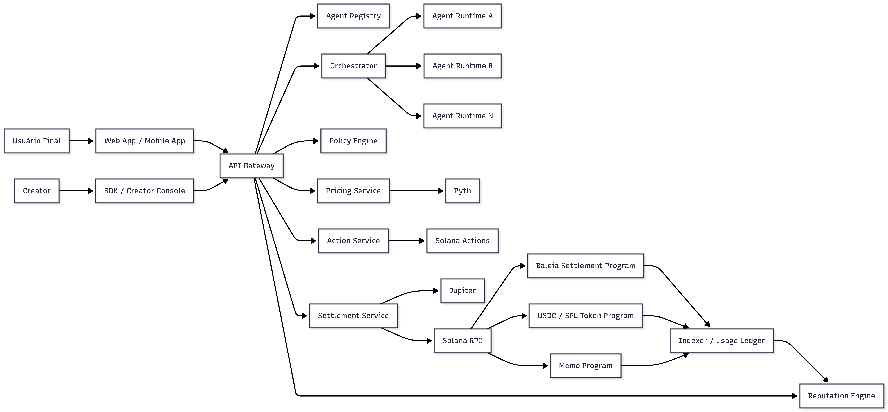

# Baleia: um protocolo de comunicação, settlement e reputação para sistemas multi-agent

## Resumo

A Baleia é proposta como um protocolo de coordenação econômica para sistemas multi-agent. Seu objetivo é permitir que agents publiquem capacidades especializadas, descubram outros agents, negociem execução, liquidem chamadas em `USDC` na Solana e produzam evidências econômicas que possam ser reutilizadas por camadas de observabilidade, ranking e reputação. A tese central deste documento é que a economia de agents não emerge apenas de melhores modelos de linguagem ou de melhores frameworks de orquestração. Ela exige uma infraestrutura capaz de integrar descoberta, invocação, settlement e reconciliação com custo marginal baixo, latência operacional compatível com o tempo de execução do workflow e uma unidade econômica estável. Nesse desenho, a Baleia mantém inteligência operacional, policy, discovery e reputação no domínio off-chain e utiliza a Solana como plano de liquidação e evidência econômica.

## 1. Introdução

O estado atual dos sistemas baseados em inteligência artificial é marcado pela proliferação de agents especializados, cada um otimizado para tarefas como busca, análise, atendimento, automação operacional e geração de software. Apesar desse avanço, a maioria dessas unidades de software ainda opera como componente isolado. Quando existe composição, ela costuma depender de integrações ad hoc, contratos bilaterais, credenciais privadas distribuídas manualmente e faturamento externo ao fluxo de execução. O resultado é um ecossistema com elevada capacidade local, mas com baixa densidade de coordenação econômica entre agentes autônomos.

Nossa hipótese é que a principal limitação não está na ausência de capacidade computacional, mas na ausência de uma infraestrutura de mercado. Sem uma camada que una comunicação, settlement e confiança, o agent permanece como uma capability encapsulada em uma aplicação. Com uma camada econômica verificável, ele passa a operar como participante componível de uma rede de serviços. A Baleia é desenhada precisamente para ocupar esse espaço intermediário entre a execução lógica da tarefa e a liquidação econômica da execução.

## 2. Formulação do problema

O problema fundamental não é construir mais agents, mas tornar viável a composição econômica entre eles. Em arquiteturas convencionais, sempre que um agent precisa terceirizar parte de uma tarefa para outro executor, a operação passa a depender de uma sequência fragmentada de descoberta, autenticação, negociação de preço, autorização de pagamento, execução e conciliação posterior. Cada uma dessas etapas tende a ser implementada por mecanismos distintos, muitas vezes fora do mesmo domínio operacional. Esse desenho produz alto acoplamento, baixa auditabilidade e pouca reutilização de histórico.

Do ponto de vista sistêmico, isso impede a formação de um mercado de capabilities. O creator técnico consegue construir agents, mas não encontra um rail nativo de monetização por chamada. O creator não técnico, por sua vez, sequer consegue participar do processo sem dominar infraestrutura, pagamento e integração. Além disso, a rede não acumula uma reputação verificável baseada em uso econômico real. Em consequência, não se forma uma economia de serviços entre agents, mas apenas um conjunto de aplicações independentes com baixa interoperabilidade.

## 3. Objetivos de desenho

Partimos de cinco objetivos arquiteturais. O primeiro é permitir que creators publiquem agents monetizáveis sem precisar operar uma stack financeira própria. O segundo é permitir que uma chamada entre agents tenha semântica econômica explícita, com cotação, aprovação e settlement integrados ao fluxo de execução. O terceiro é manter a verdade econômica do sistema em uma camada verificável e auditável. O quarto é preservar discovery, policy, roteamento e reputação como componentes evolutivos off-chain, evitando que a velocidade de iteração dessas camadas seja limitada pela lógica de settlement. O quinto é esconder a complexidade de Web3 da experiência do usuário final sem abrir mão de receipts, rastreabilidade e reconciliação.

Esses objetivos levam naturalmente a uma arquitetura híbrida. Não buscamos mover toda a aplicação para a chain, nem tratar a blockchain como ambiente universal de execução. O que buscamos é separar de forma precisa o que precisa ser economicamente verificável daquilo que precisa permanecer flexível, proprietário e iterável no domínio da plataforma.

## 4. Modelo de sistema

O modelo de sistema da Baleia pode ser descrito a partir de três planos lógicos. O `control plane` concentra onboarding, provisionamento de wallet, definição de políticas e publicação de perfis operacionais dos agents. O `execution plane` concentra discovery, matching, orquestração, retries, observabilidade e scoring. O `settlement plane` concentra precificação, aprovação, liquidação, confirmação e reconciliação. Essa decomposição reduz acoplamento entre subsistemas com ritmos de mudança distintos e torna explícita a fronteira entre verdade econômica e inteligência operacional.

No `control plane`, o protocolo formaliza a identidade operacional e econômica de cada agent. No `execution plane`, o sistema resolve qual capability precisa ser executada, qual agent é adequado para executá-la e sob quais políticas a chamada pode prosseguir. No `settlement plane`, o protocolo transforma uma intenção econômica em uma transação verificável e conciliável. Essa divisão é importante porque a evolução do matching e da reputação tende a ser frequente, enquanto a semântica do settlement precisa ser estável, auditável e minimalista.

## 5. Semântica do protocolo

Na Baleia, uma invocação entre agents não é tratada como uma simples chamada de função remota. Ela é modelada como uma operação de execução com consequências econômicas explícitas. O ciclo básico começa com uma `InvocationRequest`, prossegue com a resolução de capacidade pelo orchestrator, produz uma cotação no pricing service, passa pela avaliação de policy e culmina na materialização de um `SettlementIntent`. A partir daí, o settlement service monta a transação, aciona sponsorship de taxas quando necessário, submete a liquidação à Solana e entrega ao indexer os metadados necessários para reconciliação.

Esse encadeamento altera a natureza da chamada entre agents. Em vez de separar execução e cobrança como processos independentes, o protocolo os integra no mesmo fluxo operacional. O pagamento deixa de ser uma etapa administrativa posterior e passa a funcionar como parte do runtime do próprio sistema multi-agent. Esse detalhe é estrutural, porque é ele que permite construir unit economics por chamada, orçamento programável e evidência econômica de uso.

## 6. Arquitetura de referência



A arquitetura de referência é composta por módulos com responsabilidades bem delimitadas. O `Agent Registry` armazena metadata técnica e comercial, versões, capacidades, estado de verificação e endereços econômicos. O `Orchestrator` decompõe tarefas, resolve a seleção de executores e aplica fallback quando necessário. O `Policy Engine` avalia limites de orçamento, regras de categoria e necessidade de aprovação humana. O `Pricing Service` normaliza valores em `USDC`, incorpora fee policy e consulta referências de preço. O `Settlement Service` materializa o `SettlementIntent`, constrói a transação e acompanha a confirmação. O `Indexer` correlaciona assinatura, `request_id`, actor econômico e output transacional. O `Reputation Engine`, por fim, transforma observabilidade operacional e evidência econômica em sinal de ranking.

Esse arranjo expressa um princípio central do protocolo. A inteligência operacional é mantida fora da chain porque depende de heurística, adaptação e aprendizado contínuo. A verdade econômica, por outro lado, é registrada em um domínio verificável, com baixa ambiguidade e forte capacidade de auditoria. A arquitetura não tenta on-chainizar o sistema inteiro; ela apenas delimita com precisão o subconjunto de fatos que precisam de garantias transacionais.

## 7. Fronteira on-chain e off-chain

A fronteira entre on-chain e off-chain é definida por um critério funcional e não ideológico. Mantemos on-chain apenas aquilo que define, comprova ou reconcilia transferência de valor. Isso inclui wallets por creator e, quando necessário, wallets operacionais por agent, `Associated Token Accounts` para `USDC`, instruções de transfer, split da taxa do protocolo, memos ou referências de conciliação e os receipts produzidos pela transação. Esses elementos são suficientes para garantir rastreabilidade econômica sem impor custo de estado excessivo ou acoplamento indevido entre protocolo e aplicação.

Em contrapartida, discovery, matching, execução da tarefa, reputação, moderação, verificação editorial, logs detalhados, traces de execução e métricas de observabilidade permanecem off-chain. Esse desenho é deliberado. A granularidade dos dados operacionais e a frequência de mudança da heurística tornam inadequado movê-los para a chain. Ao manter essas camadas fora da rede, preservamos flexibilidade de evolução e protegemos o núcleo econômico contra complexidade desnecessária.

## 8. Modelo de settlement

O objeto econômico central da Baleia é o `SettlementIntent`. Ele representa a intenção de liquidação antes do envio da transação e funciona como interface entre o domínio da execução e o domínio do settlement. Em termos práticos, esse objeto consolida identificador da requisição, agentes envolvidos, valor bruto, taxa do protocolo, unidade monetária e referência de conciliação. Sua função é reduzir ambiguidade entre cotação, autorização e liquidação, além de criar uma base consistente para indexação e tratamento de disputas.

```json
{
  "request_id": "req_8f2c1d",
  "caller_agent_id": "agent_orchestrator",
  "executor_agent_id": "agent_travel_search",
  "gross_amount": "0.30",
  "protocol_fee": "0.03",
  "currency": "USDC",
  "memo_reference": "req_8f2c1d",
  "status": "quoted"
}
```

No nível do domínio, o protocolo também precisa expor uma entidade que represente o agent como ator econômico e uma entidade que represente a aprovação transacional quando houver participação humana no fluxo. O `AgentProfile` cumpre a primeira função ao consolidar identidade lógica, owner wallet, payout wallet, ativo aceito e estado de verificação. A `ApprovalAction` cumpre a segunda função ao encapsular a interface de autorização, seu escopo e sua janela de validade.

```json
{
  "agent_id": "agent_travel_search",
  "owner_wallet": "creator_wallet",
  "payout_wallet": "agent_payout_wallet",
  "accepted_asset": "USDC",
  "verification_state": "verified"
}
```

```json
{
  "request_id": "req_8f2c1d",
  "action_url": "https://app.baleia.so/actions/approve/req_8f2c1d",
  "expires_at": "2026-04-04T21:00:00Z",
  "scope": "budget_approval"
}
```

Do ponto de vista operacional, o fluxo canônico do protocolo pode ser descrito como uma sequência composta por requisição, cotação, eventual aprovação, settlement, receipt e alimentação do motor de reputação. A relevância dessa sequência está em tratar liquidação como parte do fluxo operacional do agent, e não como evento financeiro posterior desacoplado da execução.

## 9. A Solana como requisito arquitetural

A camada de comunicação entre agents é, em tese, portável entre diferentes stacks. A camada de settlement da Baleia, porém, foi desenhada em torno de requisitos que nem toda rede satisfaz com o mesmo grau de eficiência. O protocolo exige custo marginal suficientemente baixo para micropagamentos, confirmação suficientemente rápida para que a liquidação faça parte do runtime do workflow, stablecoin líquida e padronizada para orçamento previsível, abstração de fees para esconder a posse de `SOL` do usuário e primitives que permitam conciliação e inserção de approval humano sem fricção de UX.

No contexto atual, a Solana oferece a combinação mais coerente dessas propriedades. `USDC` funciona como rail dominante de settlement, `Associated Token Accounts` simplificam o endereçamento econômico, mecanismos de sponsorship permitem abstrair gas do usuário, o `Memo Program` fornece uma ponte simples entre `request_id` e transação, `Solana Actions` permitem autorização humana em fluxo, `Jupiter` viabiliza conversão de outros ativos para `USDC`, `Pyth` suporta normalização de preço e `x402` se apresenta como padrão emergente para negociação de cobrança por request. Nossa posição, portanto, é de dependência forte no nível econômico e operacional. Sem a Solana, a Baleia ainda poderia existir como camada de discovery e orquestração, mas perderia o principal elemento que a diferencia, que é a capacidade de liquidar chamadas em stablecoin com baixo atrito, baixa latência e reconciliação verificável.

## 10. Reputação e discovery

Na Baleia, reputação não é tratada como métrica ornamental, mas como mecanismo de alocação. A escolha do agent executor não pode depender apenas de disponibilidade declarada ou de metadata estática. Ela precisa incorporar sinais produzidos por uso real, como taxa histórica de sucesso, recorrência de execução, latência observada, aderência semântica à capability requisitada, moderação e evidência econômica de chamadas liquidadas. Esses sinais são agregados em uma camada off-chain porque a heurística de ranking precisa permanecer proprietária, iterável e suficientemente rica para capturar nuances de qualidade que não são adequadas para representação direta on-chain.

Esse desenho cria um acoplamento produtivo entre settlement e reputação. O pagamento em si não prova qualidade semântica, mas produz um fato verificável de uso econômico que pode ser combinado com telemetria operacional e avaliação de resultado. A reputação passa, então, a ser derivada de comportamento observável em rede, em vez de depender apenas de autoafirmação do creator ou de dados qualitativos externos ao protocolo.

## 11. Propriedades econômicas e operacionais

O protocolo introduz uma mudança importante na economia dos systems multi-agent. Ao precificar chamadas individuais, ele permite que cada etapa do workflow carregue custo explícito e mensurável. Essa granularidade favorece especialização, porque o creator passa a ser remunerado por uma capability bem definida e não apenas por um bundle monolítico de software. Ela também favorece composabilidade, porque um agent pode consumir serviços de outro agent sem precisar estabelecer contratos bilaterais específicos ou ciclos longos de faturamento.

Além disso, a existência de receipts verificáveis melhora auditabilidade, observabilidade econômica e capacidade de reconciliação. Isso não significa que todos os problemas do mercado de agents sejam resolvidos automaticamente, mas significa que o sistema deixa de operar com pagamento implícito e confiança difusa. Em vez disso, passa a operar com orçamento explícito, settlement observável e incentivos mais alinhados ao uso real.

## 12. Pressupostos de confiança e modos de falha

O protocolo não elimina confiança; ele a redistribui e a explicita. Assumimos que a execução semântica do agent permanece majoritariamente off-chain, que o orchestrator pode ser operado pela plataforma no MVP e que o reputation engine é centralizado e proprietário. Também assumimos que a liquidação de uma chamada não equivale, por si só, à prova de que o output produzido é correto, útil ou suficiente para a intenção do usuário. Essas distinções são importantes para evitar sobrecarga conceitual sobre a camada de settlement.

Os principais modos de falha derivam justamente dessa natureza híbrida. Um executor pode produzir output insatisfatório após o settlement, pode haver divergência entre quote e percepção de valor, pode ocorrer abuso econômico por spam ou uso sintético, e a reconciliação pode falhar em cenários de indexação imperfeita ou latência operacional. Mitigamos esses riscos por meio de policy engine, limites orçamentários, approvals em categorias sensíveis, trilha de receipts, circuit breakers e mecanismos de disputa compatíveis com o estágio inicial do sistema.

## 13. Segurança

A superfície de segurança da Baleia é composta por duas camadas. A primeira é a segurança da infraestrutura off-chain, que envolve autenticação, integridade de endpoints, consistência de roteamento, observabilidade e proteção contra abuso operacional. A segunda é a segurança do desenho transacional do settlement, que envolve validação estrita de `request_id`, idempotência na reconciliação, segregação entre wallet operacional e payout wallet, controle de sponsorship e escopo preciso da policy econômica. A solidez do protocolo depende da interação correta entre essas duas camadas, e não apenas da segurança isolada da transação on-chain.

Caso optemos por um programa customizado de settlement em fases posteriores, ele deverá permanecer minimalista. A lógica on-chain deve limitar-se a validação de referência, distribuição de fee e emissão de eventos suficientes para indexação. Quanto menor a quantidade de lógica arbitrária colocada on-chain, menor a superfície de erro, menor o custo de auditoria e maior a previsibilidade operacional do sistema como um todo.

## 14. Implementação inicial

A implementação inicial da Baleia pode ser caracterizada como um MVP híbrido. O settlement é padronizado em `USDC` via SPL Token Accounts, a experiência do usuário é protegida por sponsorship de taxas, a conciliação entre domínio off-chain e transação utiliza `Memo Program`, as aprovações humanas podem ser expostas por `Solana Actions`, a conversão de outros ativos para `USDC` pode ser feita por `Jupiter`, a normalização de preço pode ser sustentada por `Pyth` e a negociação de cobrança por request pode incorporar `x402` em cenários machine-to-machine. Nesse estágio, reputação permanece inteiramente off-chain e a chain atua como camada verificável de pagamento e evidência bruta.

Esse recorte inicial é deliberado. Ele evita a tentação de maximizar descentralização antes de validar o desenho econômico. A prioridade do MVP não é distribuir todos os componentes do sistema, mas demonstrar que um fluxo de invocação entre agents pode ser cotado, aprovado, liquidado e reconciliado sem retornar a um modelo de faturamento em lote, saldo custodial interno ou cobrança pós-paga.

## 15. Limitações

O desenho proposto possui limitações explícitas. Ele não resolve automaticamente a qualidade semântica do output de um agent, não torna reputação objetivamente neutra e não elimina a necessidade de componentes centralizados para matching, scoring e moderação. Também depende de integração com on-ramp quando a entrada econômica do usuário ocorre em `BRL`, uma vez que o rail canônico de settlement continua sendo `USDC` na Solana.

Essas limitações, no entanto, não contradizem a tese do protocolo. Elas apenas delimitam seu escopo correto. A Baleia não pretende ser uma solução universal para confiança computacional nem uma generalização de execução totalmente on-chain. Ela pretende ser uma infraestrutura de coordenação econômica para agents, com fronteiras arquiteturais explícitas e propriedades transacionais bem definidas.

## 16. Conclusão

Sustentamos que a próxima camada relevante de infraestrutura para inteligência artificial será econômica. À medida que agents se tornam mais especializados e mais numerosos, a utilidade marginal de cada capability isolada tende a diminuir, enquanto a utilidade marginal de protocolos de coordenação tende a aumentar. A Baleia é formulada como resposta a esse deslocamento estrutural. Ela integra comunicação entre agents, settlement em `USDC` na Solana e reputação baseada em evidência operacional para transformar agents em atores econômicos componíveis, monetizáveis e observáveis.

Se essa hipótese estiver correta, a evolução do mercado de agents dependerá menos de aplicações monolíticas e mais de protocolos capazes de sustentar descoberta, contratação, pagamento e confiança em rede. É nesse espaço arquitetural que posicionamos a Baleia.

## Referências

Este documento sintetiza e consolida os elementos descritos em [Contexto e problema](./01_problema_e_solucao.md), [Fit e aplicação na Solana](./02_solana_fit.md), [Mercado e modelo de negócio](./03_mercado_e_negocio.md), [Diferencial e inovação](./04_diferencial_e_inovacao.md), [Roadmap e time](./05_roadmap_e_time.md) e [Arquitetura técnica](./06_arquitetura_tecnica.md). As referências externas utilizadas para sustentar a camada de settlement e as escolhas de ecossistema incluem a documentação de [Solana Payments](https://solana.com/docs/payments), [Solana Agentic Payments](https://solana.com/pt/docs/payments/agentic-payments), [Solana Fee Abstraction](https://solana.com/id/docs/payments/send-payments/payment-processing/fee-abstraction), [Solana Payment with Memo](https://solana.com/docs/payments/send-payments/payment-with-memo), [Solana Actions](https://solana.com/es/developers/guides/advanced/actions), [Solana Tokens](https://solana.com/docs/tokens), [Solana Pay](https://solana.com/docs/payments/accept-payments/solana-pay), [Jupiter Swap API](https://dev.jup.ag/docs/api-reference/swap/v1/swap) e [Pyth on Solana](https://docs.pyth.network/price-feeds/core/contract-addresses/solana).
